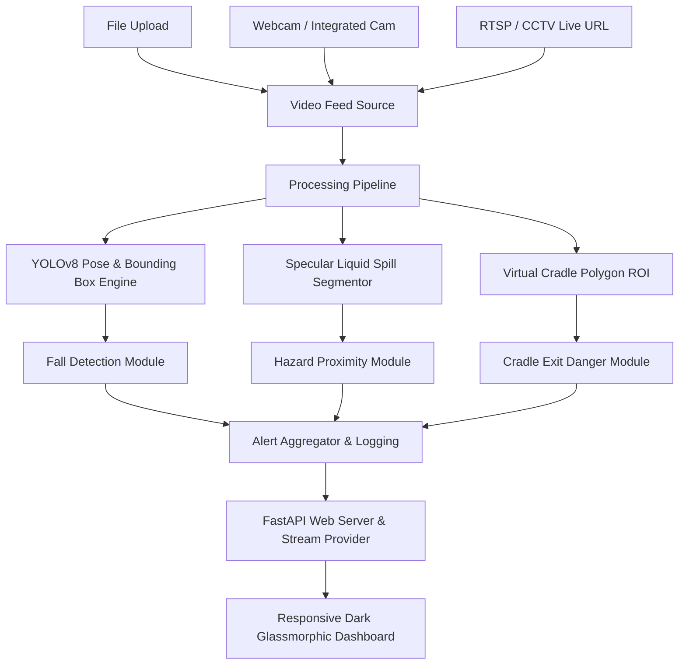

# 🛡️ GuardianCam AI - Camera-Based Child Safety & Monitoring System

[](https://www.python.org/)
[](https://fastapi.tiangolo.com/)
[](https://opencv.org/)
[](https://docs.ultralytics.com/)
[](LICENSE)

An intelligent, real-time AI computer vision system designed to monitor toddlers and children, detect potential physical dangers (falls, crib/cradle breaches, surrounding hazards, and liquid spills), and provide immediate visual & audio alerts on a web dashboard.

---

## 📸 Key Scenarios Supported

### 1. 🚼 Toddler Bed & Cradle Exit Danger Detection
- **Virtual Safety Boundary (ROI)**: Define custom crib/bed safe zones.
- **Exit & Climbing Prediction**: Detects when a toddler approaches the cradle wall, attempts to climb over, or exits the safe area.
- **Immediate Alert**: Triggers a high-priority `CRADLE_BREACH` alert before a fall occurs.

### 2. 🤸 Play Area Activity & Child Fall Detection
- **Pose Keypoint Geometry**: Uses YOLOv8 Pose Estimation (tracking head, shoulders, torso, hips, knees, ankles).
- **Fall Detection Heuristics**: Analyzes bounding box aspect ratio ($W/H > 1.1$), torso vertical tilt angle ($>55^\circ$), vertical drop velocity ($dY/dt$), and sustained horizontal posture on the ground.
- **Safety Score**: Differentiates between normal walking/sitting and sudden falls.

### 3. ⚠️ Surroundings & Liquid Spill Hazard Detection
- **Surface Liquid Spill Segmentation**: Uses HSV specular reflection and texture variance to detect wet floor spots, water, or oil spills.
- **Hazardous Object Proximity**: Identifies dangerous items (scissors, knives, hot kettles, heavy unanchored objects).
- **Proximity Alerts**: Alerts parents if a child gets within a hazardous radius of a spill or sharp object.

---

## 🖥️ User Interface & Video Source Options

The web interface provides real-time streaming, dynamic metrics, and customizable video sources:

- 📁 **Video File Upload**: Upload and scan local video files (`.mp4`, `.avi`, `.mov`, `.mkv`, `.webm`).
- 🎥 **Integrated Webcam & External Cameras**: Connect directly to camera device index (Webcam 0, 1, external USB cameras).
- 🌐 **RTSP / CCTV Live Stream URL**: Input live IP camera feed URLs (RTSP / HTTP live video stream).
- 🎬 **Pre-packaged Demo Streams**: 3 built-in scenario demonstration videos available out-of-the-box for instant testing.
- 🔊 **Synthesized Audio Alarm**: Plays warning sirens using HTML5 Web Audio API upon critical alerts.
- 📊 **Real-Time Analytics & Chart**: Live graphs tracking active children, falls, cradle breaches, hazard events, and system safety status.

---

## 🛠️ Architecture & Tech Stack



### Core Technologies
- **Computer Vision**: `ultralytics` (YOLOv8 / YOLO-Pose), `opencv-python`, `numpy`, `scipy`.
- **Backend API**: `FastAPI`, `uvicorn`, `Jinja2`, `threading`.
- **Frontend Dashboard**: HTML5, Vanilla CSS3 (Dark Glassmorphism design system), JavaScript (ES6+), `Chart.js`, `Lucide Icons`, HTML5 Web Audio API.

---

## 📁 Project Structure

```text
py_cam_alerts/
├── app.py                     # FastAPI Web Application & REST API Server
├── vision/
│   ├── __init__.py
│   ├── detector.py            # Main AI Engine integrating Pose, Fall, Cradle & Hazards
│   ├── fall_detector.py       # Pose keypoint angle, velocity, aspect ratio fall logic
│   ├── cradle_detector.py     # Virtual boundary breach & exit prediction logic
│   └── hazard_detector.py     # Liquid spill segmentation & dangerous object proximity
├── templates/
│   └── index.html             # Responsive Dark Glassmorphism Dashboard Template
├── static/
│   ├── css/
│   │   └── style.css          # CSS Tokens, Animations, Glassmorphism Styling
│   └── js/
│       └── main.js            # Video stream controller, Chart.js, Web Audio alarms
├── sample_data/
│   └── generate_test_videos.py# Synthetic test video clip generator for instant demo testing
├── test_app.py                # Backend unit test suite
├── requirements.txt           # Python package dependencies
└── README.md                  # System Documentation
```

---

## 🚀 Quick Start Guide

### Prerequisites
- **Python**: Version 3.8 or higher installed.

### 1. Clone the Repository
```bash
git clone https://github.com/tdhanesh1992/py_cam_alerts.git
cd py_cam_alerts
```

### 2. Install Dependencies
```bash
pip install -r requirements.txt
```

*(Optional: Install PyTorch and Ultralytics CPU models for YOLO pose estimation)*
```bash
pip install ultralytics torch torchvision --extra-index-url https://download.pytorch.org/whl/cpu
```

### 3. Generate Demo Video Streams (Optional)
Generate the 3 pre-packaged test videos for instant demo testing:
```bash
python sample_data/generate_test_videos.py
```

### 4. Run the Web Application
```bash
python -m uvicorn app:app --host 0.0.0.0 --port 8000
```

### 5. Open Web Dashboard
Open your browser and navigate to:
**`http://localhost:8000`**

---

## 📊 Computer Vision Detection Algorithms

### Fall Detection Logic (`vision/fall_detector.py`)
- Calculates bounding box aspect ratio:
  $$\text{Aspect Ratio} = \frac{\text{Width}}{\text{Height}}$$
- Computes Torso Angle $\theta$ relative to vertical axis using shoulder and hip keypoint coordinates:
  $$\theta = \left|\arctan\left(\frac{\Delta X}{-\Delta Y}\right)\right|$$
- Tracks vertical centroid velocity ($dY/dt$) over recent frames to detect sudden drops.

### Cradle ROI Boundary Check (`vision/cradle_detector.py`)
- Uses point-in-polygon tests (`cv2.pointPolygonTest`) to measure the Euclidean distance between the child's head/torso centroid and the crib perimeter polygon.
- Warns when distance $< 30\text{px}$ and alerts when child crosses boundary.

### Floor Liquid Spill Detection (`vision/hazard_detector.py`)
- Converts RGB frames to HSV color space.
- Detects high luminance specular reflection ($V > 215$) combined with low saturation ($S < 65$) on floor surface.
- Morphological closing/opening filtering highlights wet spots and calculates proximity distance to children.

---

## 📄 License

Distributed under the MIT License. See `LICENSE` for more information.
